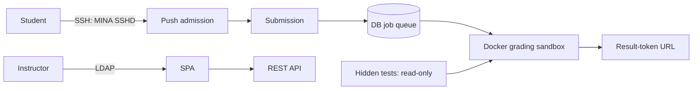
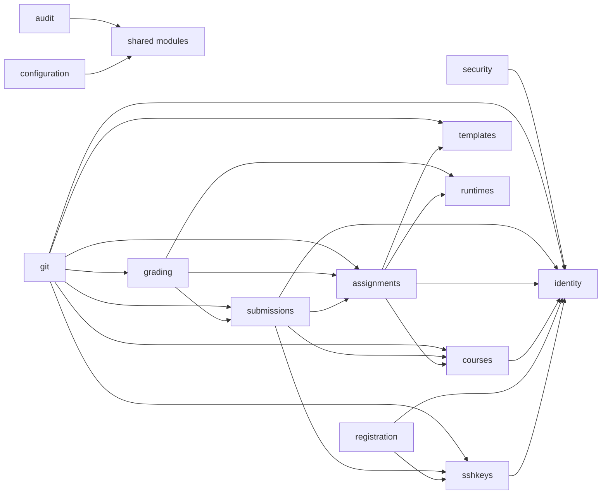

# GitGrader

[](https://github.com/git-grader/gitgrader/actions/workflows/build.yml)
[](LICENSE)

GitGrader is an open-source, self-hostable platform for courses that accept
programming assignments over Git: students push work through SSH, the service
records an immutable submission and grades it in an isolated container, while
instructors manage coursework through a web interface.

## Scope and limitations

GitGrader is a grading and submission system, not an authorship detector. A
verified commit signature proves that the commit was signed by a key registered
careful runner/host isolation. In particular, the default Docker socket mount is

## Quick start

```sh
git clone <repo> && cd git-grader && cp .env.example .env && docker compose up -d
```

Before sharing the service, edit `.env`: replace the marked passwords and set
the public HTTP/SSH names. Compose starts PostgreSQL then the app; use
`docker compose ps` to wait for healthy services and run
`scripts/verify-install.sh` to check readiness, API meta, and SSH. The command
requires the configured GHCR image tag to have been published; otherwise build
an image locally with `./mvnw spring-boot:build-image`.





The database records scoring as a percentage: `tests passed / tests total × 100`.
For example, 7 of 10 tests is **70.0 %**.

## Features and stack

- Git-over-SSH admission with registered-key and SSHSIG checks.
- Versioned templates, hidden test suites, runtimes pinned by image digest, and
  append-only submissions and grading runs.
- PostgreSQL-backed queue, container runner isolation, opaque result tokens,
  LDAP instructor/admin authentication, audit events, and rate limits.
- Java 25, Spring Boot 4.1.0, Spring Modulith 2.1.0, Spring Security 7.1,
  JGit 7.7.1, Apache MINA SSHD 2.19.0, docker-java 3.7.1, Flyway 12.4,
  PostgreSQL, Testcontainers 2.0.5; Vite, React 19, TypeScript, MUI v7,
  TanStack Query, and React Router.

## Documentation

- [Architecture](docs/architecture.md)
- [Security model](docs/security.md)
- [Installation](docs/installation.md)
- [Operations](docs/operations.md)
- [Backup and restore](docs/backup-restore.md)
- [Upgrade](docs/upgrade.md)
- [Development](docs/development.md)
- [Manual testing](docs/manual-testing.md)
- [Configuration](docs/configuration.md)
- [API](docs/api.md)
- [Release process](docs/release-process.md)
- [Privacy](docs/privacy.md)

See [CONTRIBUTING.md](CONTRIBUTING.md), [SECURITY.md](SECURITY.md), and
[CHANGELOG.md](CHANGELOG.md) for contribution, vulnerability, and release
policy.
