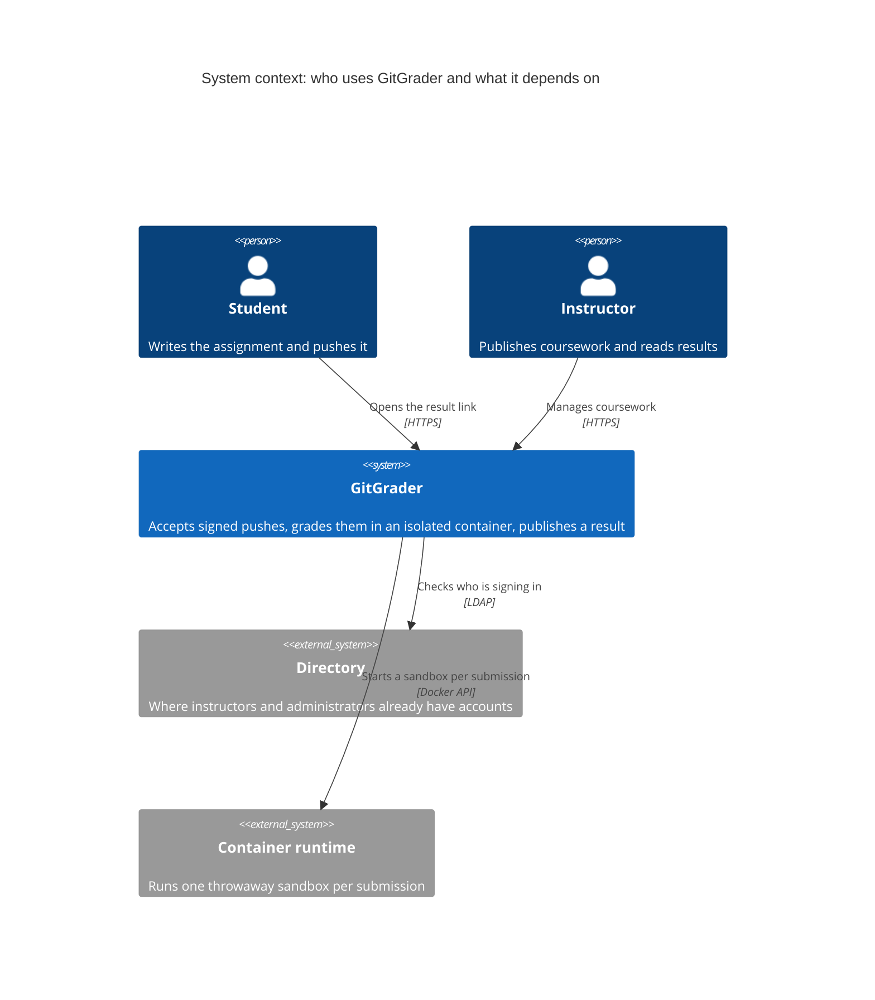

# GitGrader

[](https://github.com/git-grader/gitgrader/actions/workflows/build.yml)
[](LICENSE)

GitGrader is an open-source, self-hostable platform for courses that accept
programming assignments over Git: students push work through SSH, the service
records an immutable submission and grades it in an isolated container, while
instructors manage coursework through a web interface.

## Scope and limitations

GitGrader is a grading and submission system, not an authorship detector. A
verified commit signature proves that the commit was signed by a key registered
to that student, not that the student wrote the work unaided; self-registration
does not verify identity either. Use assessment policy, supervision, and review
for authorship claims.

It also runs untrusted student code, which needs careful runner/host isolation.
In particular, the default Docker socket mount is effectively host root:
compromising the application compromises the host. Read the
[security model](docs/security.md) before letting anyone else near an instance.

## Quick start

Needs Docker, and JDK 25 the first time so the image can be built.

```sh
git clone git@github.com:git-grader/gitgrader.git
cd gitgrader
./scripts/install.sh --demo
```

That brings up the service on <http://localhost:8080> with a sample course
loaded, so there is something to grade straight away. Sign in as
`instructor` / `password`. To walk the whole path a student takes, follow the
[manual testing guide](docs/manual-testing.md).

Leave off `--demo` for an empty instance. Before anyone else uses it, read
[installation](docs/installation.md): the passwords in `.env` are the example
ones and the service expects to sit behind HTTPS.



**Reading it.** A person is someone using the service; a plain box is the service
itself; a shaded box is something it depends on but does not own. Each arrow is
labelled with what crosses it and over which protocol.

Two things are worth noticing. Students never get an account: an SSH key
identifies them when pushing, and an unguessable link is the only credential
needed to read a result. And grading is the one place the service reaches
outward, starting a container it then throws away.

[The architecture guide](docs/architecture.md) goes on to the containers inside
that single box, the modules inside those, and the path a submission takes.

The database records scoring as a percentage: `tests passed / tests total × 100`.
For example, 7 of 10 tests is **70.0 %**.

## Features and stack

- Git-over-SSH admission with registered-key and SSHSIG checks.
- Versioned templates, hidden test suites, runtimes pinned by image digest, and
  append-only submissions and grading runs.
- PostgreSQL-backed queue, container runner isolation, opaque result tokens,
  LDAP instructor/admin authentication, audit events, and rate limits.
- Java 25, Spring Boot 4.1.0, Spring Modulith 2.1.0, Spring Security 7.1,
  JGit 7.7.1, Apache MINA SSHD 2.19.0, docker-java 3.7.1, Flyway 12.4,
  PostgreSQL, Testcontainers 2.0.5; Vite 8, React 19, TypeScript, MUI v9,
  TanStack Query, and React Router 8.

## Documentation

- [Architecture](docs/architecture.md)
- [Security model](docs/security.md)
- [Installation](docs/installation.md)
- [Operations](docs/operations.md)
- [Backup and restore](docs/backup-restore.md)
- [Upgrade](docs/upgrade.md)
- [Development](docs/development.md)
- [Manual testing](docs/manual-testing.md)
- [End-to-end test](docs/e2e-test.md)
- [Configuration](docs/configuration.md)
- [API](docs/api.md)
- [Release process](docs/release-process.md)
- [Privacy](docs/privacy.md)

See [CONTRIBUTING.md](CONTRIBUTING.md), [SECURITY.md](SECURITY.md), and
[CHANGELOG.md](CHANGELOG.md) for contribution, vulnerability, and release
policy.
