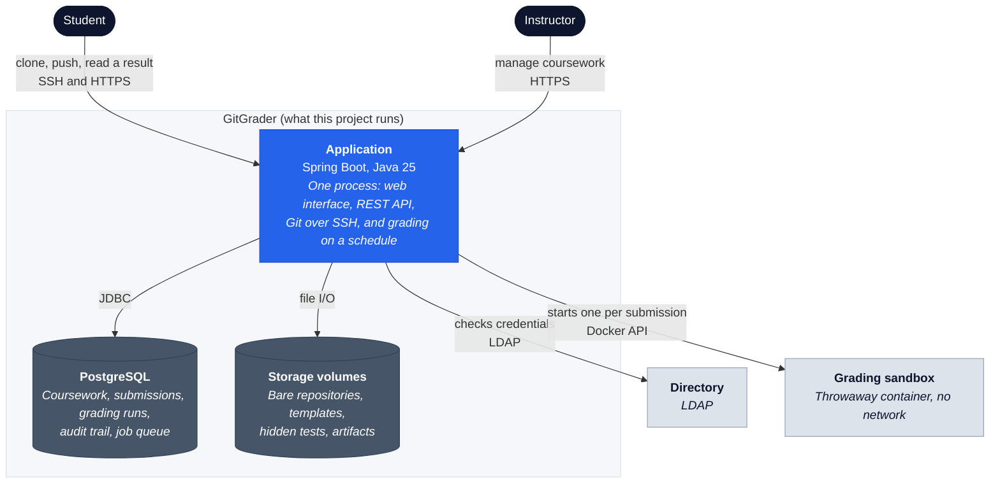
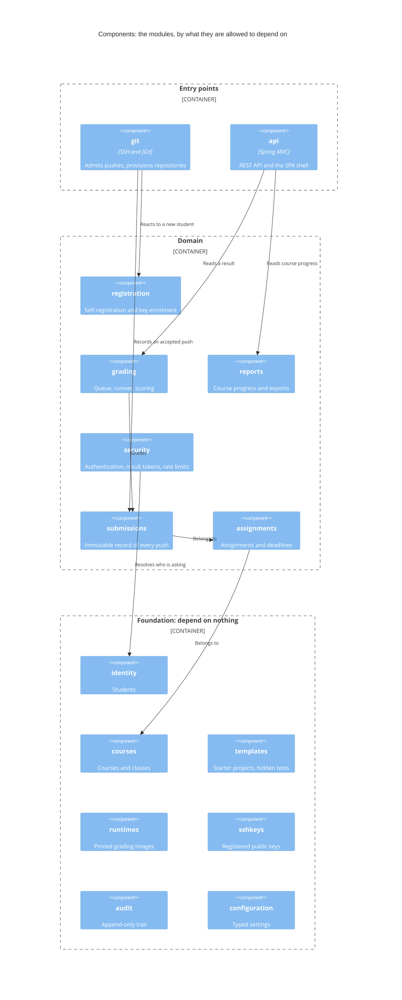
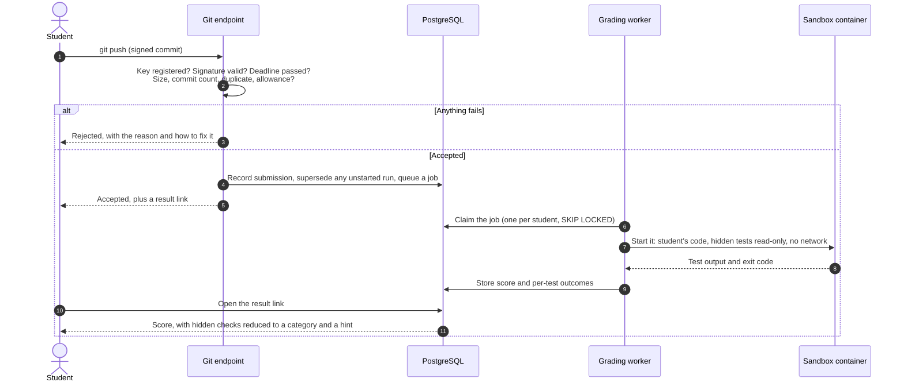

# Architecture

GitGrader is a modular monolith: one deployable Spring Boot application with
explicit, tested module boundaries. This keeps installation, transactional
integrity, and operational ownership simple while preventing the unstructured
coupling typical of a monolith. Spring Modulith verifies the dependencies
declared by each module’s `package-info.java`.

**Reading it.** A rounded dark box is a person. Inside the shaded boundary is
what this project runs: a plain box is a process, a cylinder is where state
lives. A pale box outside the boundary is something it talks to but does not
own. Each arrow is labelled with what crosses it and over which protocol.

The single application box is the point. HTTP, SSH and grading are one process,
not three services, so a submission is recorded and queued in one transaction
and there is one thing to install and back up. The sandbox is outside the
boundary because it is deliberately not ours: it is created per submission,
given no network, and destroyed.

## Module structure

Fifteen modules, each declaring in its `package-info.java` exactly which others
it may use. Spring Modulith fails the build when code crosses a boundary that
was not declared, so the table below is enforced rather than aspirational.

**Reading it.** Boxes are modules, grouped by how far they sit from the outside
world. The three arrows are the direction dependencies are allowed to run:
downward only. Nothing in Foundation may reach up, which is why those seven
modules have no declared dependencies at all.

The diagram shows the shape; this table is the contract, and matches each
`package-info.java` exactly:

| Module | May depend on |
|---|---|
| `audit`, `configuration`, `courses`, `identity`, `runtimes`, `sshkeys`, `templates` | *nothing* |
| `assignments` | courses, templates, runtimes, identity |
| `submissions` | identity, assignments, courses, sshkeys |
| `security` | identity, submissions |
| `grading` | submissions, assignments, runtimes, templates |
| `reports` | identity, courses, assignments, submissions |
| `registration` | identity, sshkeys, courses, security |
| `api` | identity, sshkeys, reports, courses, assignments, submissions, grading, security |
| `git` | identity, sshkeys, courses, assignments, templates, submissions, grading, security, registration |

Two dependencies that would otherwise be cycles are carried by events instead.
`submissions` publishes `SubmissionRecorded` and `grading` consumes it, so
recording a push never waits for a grade. `registration` publishes
`StudentRegistered` and `git` consumes it to create the student's repositories,
so registering never waits for a dozen repositories to appear on disk. Spring
Modulith persists both publications and replays anything outstanding at
restart, so no broker is involved.

## How a submission becomes a result

**Reading it.** Time runs downward. A solid arrow is a request, a dashed one a
reply. The `alt` block is a branch: either the push is refused or it proceeds.

Steps 2 and 3 are where most of the value sits: a push is refused early, in the
one place the student is already looking, with a message telling them what to
change. Step 6 is why the queue is in PostgreSQL rather than a broker: claiming
a job is a row lock in the same database as the submission, so a worker cannot
lose or duplicate work. Step 11 is the whole of what a student is shown about a
hidden check: a category and a hint, never its name or the assertion it made.

## Queue and runner

Grading work is also represented by `grading_jobs`. PostgreSQL is the queue:
workers claim pending rows using `SELECT … FOR UPDATE SKIP LOCKED`, with
priority, availability, claim expiry, attempt count, and a partial runnable-job
index. This provides concurrent-worker semantics without operating RabbitMQ or
another broker; a narrow runner interface leaves room for a future broker.

The claim is also where fairness lives. A plain FIFO let one student own the
queue, because a loop of pushes produced a job per push and every one of them
sat in front of the rest of the course. The claim now reduces the candidates to
each student's oldest job and skips students who already occupy a worker, so a
student holds at most one worker however many assignments they have queued and a
backlog drains in round-robin order rather than in submission order.

Coalescing keeps the queue short in the first place. A partial unique index
allows one `PENDING` job per student and assignment, so queueing a newer
submission withdraws the older one as `CANCELLED` rather than adding to it. Work
a worker already claimed is never withdrawn: cancelling a running sandbox would
abandon its container and workspace. Every push is still recorded, so the
attempt history the product promises is unchanged — a superseded submission is
one that exists and was not graded, not one that was lost.

`GradingRunner` is the only intended path to execute untrusted code. The Docker
implementation runs a short-lived non-root container with network disabled by
capabilities, and no-new-privileges. To add a runner, implement the runner
contract, preserve the run’s timeout/resources/artifact/report semantics, select
it through `grading.runner`, and add integration tests proving hidden tests and
student work mounts retain their access controls. Do not use process spawning in

## Data model and history

UUIDs avoid exposing sequential enrolment or submission counts. All meaningful
timestamps are `TIMESTAMPTZ`. Core relationships are students/instructors,
keys, courses/enrolments, runtimes, templates/test suites, assignments,
repositories, submissions, grading runs/jobs/results/logs, result tokens, and
audit events.

`ssh_keys`, `submissions`, `grading_runs`, `template_versions`, and
`test_suite_versions` preserve history rather than destructively rewriting it.
Keys are revoked/replaced; submissions have no `updated_at`; regrades append an
attempt; published templates and test suites retain their content-addressed
version; runtimes retain the immutable image digest. This makes a historical
grade explainable from the accepted commit, versions, runner image, and run.

Score percentage is `tests_passed / tests_total × 100`. For example, 7 passing
tests out of 10 is `7 / 10 × 100 = 70.0 %`.
