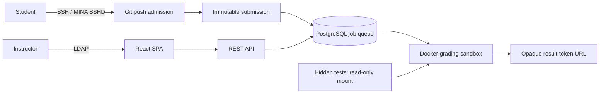
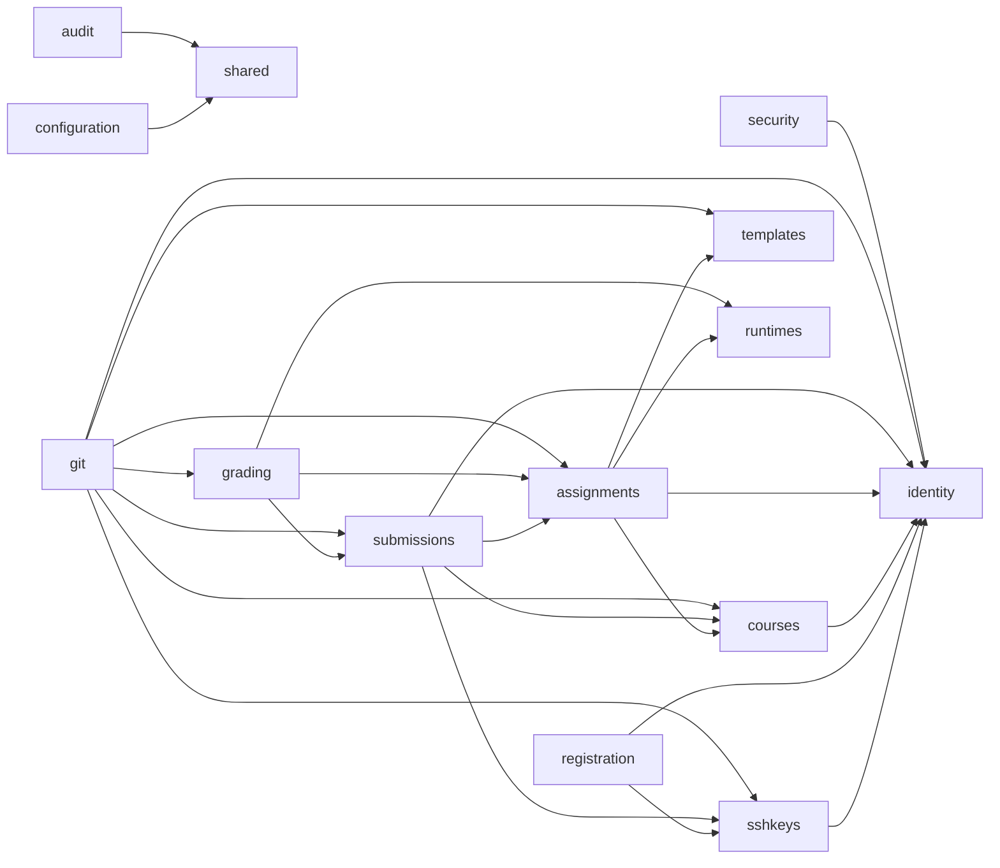

# Architecture

GitGrader is a modular monolith: one deployable Spring Boot application with
explicit, tested module boundaries. This keeps installation, transactional
integrity, and operational ownership simple while preventing the unstructured
coupling typical of a monolith. Spring Modulith verifies the dependencies
declared by each module’s `package-info.java`.

## Module graph

The repository currently contains 13 `package-info.java` application modules,
not 14: there is no `reports` module declaration. The diagram reflects the
implemented module declarations rather than an aspirational list. `configuration`
and `audit` are shared modules declared on the application class.

The potentially cyclic Git → submissions → grading path is deliberately broken:
submissions publish `SubmissionRecorded`; grading consumes it. Spring Modulith
persists publications through its JPA registry and republishes outstanding
events at restart, so submission persistence does not synchronously wait for a
grade and no external broker is required.

## Queue and runner

Grading work is also represented by `grading_jobs`. PostgreSQL is the queue:
workers claim pending rows using `SELECT … FOR UPDATE SKIP LOCKED`, with
priority, availability, claim expiry, attempt count, and a partial runnable-job
index. This provides concurrent-worker semantics without operating RabbitMQ or
another broker; a narrow runner interface leaves room for a future broker.

`GradingRunner` is the only intended path to execute untrusted code. The Docker
implementation runs a short-lived non-root container with network disabled by
capabilities, and no-new-privileges. To add a runner, implement the runner
contract, preserve the run’s timeout/resources/artifact/report semantics, select
it through `grading.runner`, and add integration tests proving hidden tests and
student work mounts retain their access controls. Do not use process spawning in

## Data model and history

UUIDs avoid exposing sequential enrolment or submission counts. All meaningful
timestamps are `TIMESTAMPTZ`. Core relationships are students/instructors,
keys, courses/enrolments, runtimes, templates/test suites, assignments,
repositories, submissions, grading runs/jobs/results/logs, result tokens, and
audit events.

`ssh_keys`, `submissions`, `grading_runs`, `template_versions`, and
`test_suite_versions` preserve history rather than destructively rewriting it.
Keys are revoked/replaced; submissions have no `updated_at`; regrades append an
attempt; published templates and test suites retain their content-addressed
version; runtimes retain the immutable image digest. This makes a historical
grade explainable from the accepted commit, versions, runner image, and run.

Score percentage is `tests_passed / tests_total × 100`. For example, 7 passing
tests out of 10 is `7 / 10 × 100 = 70.0 %`.
