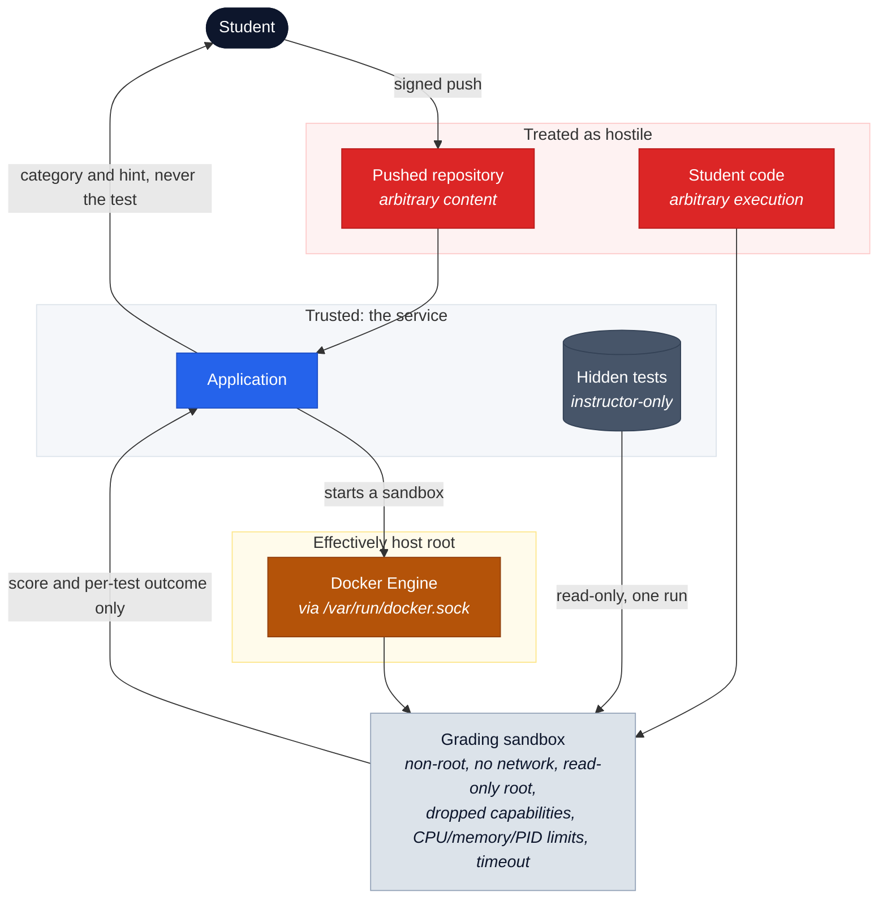

# Security model

GitGrader accepts untrusted student repositories and runs untrusted code. It is
not a general-purpose sandbox and must be deployed as a security-sensitive
service on infrastructure appropriate for that risk.

## What is trusted

**Reading it.** Red is content the service assumes is hostile. Blue is the
service itself. Grey is material a student must never see. Amber is the one
edge where a compromise stops being contained.

Three things this is meant to make obvious. Student code only ever executes
inside the sandbox, never in the application. Hidden tests enter that sandbox
read-only for a single run and leave it only as a score and a category, never
as a name or an assertion. And the application holds the Docker socket, so
compromising the application is compromising the host: the hardening below
narrows what a submission can do, it does not contain a broken application.

## Execution isolation

The Docker runner is configured to run as a non-root user, with network disabled
by default, a read-only root filesystem, bounded tmpfs, dropped capabilities,
`no-new-privileges`, PID/CPU/memory limits, a timeout, log-size limit, and
short-lived container cleanup. These reduce risk; they do not make kernel or
Docker vulnerabilities impossible. Patch the host and runner images promptly.

Hidden tests must never appear in: student Git repositories; templates; clone
URLs; student-facing result pages; student-facing logs; public API responses or
OpenAPI examples; or diagnostic/support logs. Store them only below the separate
tests directory and mount them read-only for a single grading run. Raw hidden
test names, assertion output, and grading logs are instructor-only.

## Grading integrity: the manifest decides what exists

A sandbox runs the reporter and the submission in one container, so both write
to the same standard output. Nothing distinguishes a line the test reporter
emitted from one the submission printed itself, and a submission containing
`process.stdout.write("ok 1 - anything\n")` produces output that reads exactly
like a passing test.

`manifest.json` is therefore the authority on which tests exist, not the output.
Exactly one result is recorded per declared test, in manifest order; a line
naming anything else is discarded; a declared test the output never reported is
`NOT_EXECUTED`; and a declared test reported twice is not counted as passed,
because a suite reports each test once. A suite published without a manifest, or
with one declaring no tests, is refused as an infrastructure error rather than
graded — a run that cannot produce a defensible grade must never produce a mark.

What this does not close is a submission that guesses a hidden test's exact name
and forges a pass for a test that never ran. That is why hidden names are secret:
the result page shows a category and a hint, never a name. Closing it entirely
requires running the reporter and the submission in separate containers, which
the current single-sandbox design does not do.

## Docker socket: effective host root

Mounting `/var/run/docker.sock` into the application container is effectively
host-root access. The Docker API permits creating privileged containers, mounting
host paths, changing namespaces, or running commands with access equivalent to
the Docker daemon. Application compromise can therefore become host compromise.
The default Compose file includes the mount only because the current in-process
Docker runner requires it; do not mistake container hardening for protection from
that socket.

Hardening options:

1. Put a Docker socket proxy between the application and engine, with a minimal
   API allow-list for the runner. This reduces accidental API reach but the exact
   allowed API set must be reviewed as privileged.
2. Prefer a separate runner service on isolated infrastructure. The hardened
   topology is: **Web app → internal API → Runner service → Docker Engine**.
   The web app receives no Docker socket; mutual authentication, authorization,
   network policy, and an explicit job/artifact protocol protect the internal API.

## Identity, keys, and attribution

SSH transport identity is the registered public key. The system accepts selected
key types and enforces a minimum RSA modulus of 3072 bits. Protect host-key and
database backups, reject private keys at registration, retain key revocation
history, and rotate/revoke lost keys.

Each accepted commit is checked for an SSHSIG made by a key registered to the
same student. A verified signature proves only that the commit was signed by a
key registered to that student. It is **not** evidence of unaided authorship,
and self-registration does **not** verify identity. Use assessment policy,
supervision, and review processes for authorship claims.

Result URLs use high-entropy opaque tokens. Store only their hash plus a short
support prefix; expire and revoke tokens, limit lookup attempts, and never log
the complete value. Registration, login, SSH authentication, and token lookup
use rate limits; audit events use hashed source IPs and must not contain private
keys, passwords, or complete tokens.

Those limits count the address the servlet container reports, never an
`X-Forwarded-For` header read straight off the request. A client sets that header
itself, so counting it would let one caller land in a new bucket on every attempt
and spend an unlimited number of sign-ins, registrations or token guesses.

The consequence is operational: behind a reverse proxy, every client arrives as
the proxy and shares one bucket unless `server.forward-headers-strategy` is set
to `framework` or `native`, which makes the container resolve the real client
first. Set it when, and only when, the proxy is trusted to overwrite the header
it forwards. Leaving it at `none` behind a proxy is safe but blunt: the limits
then apply to everyone at once.

## Push admission and abuse limits

A push is admitted only if it updates a branch under `refs/heads/`, is not a
deletion, is not a non-fast-forward, arrives while the assignment accepts work,
introduces at least one and at most 1000 new commits, produces a tree within
`git.max-file-count`, stays within `git.max-push-size` and `git.max-file-size`,
carries a commit not already submitted to that repository, and — when signing is
required — has an acceptable SSHSIG on **every** commit it introduces.

The commit ceiling refuses the push rather than truncating the walk. Truncating
would leave the commits past the ceiling unverified while still admitting them,
which would let a large enough push carry unsigned history in behind a signed
tip. Treat the ceiling as part of the signature guarantee, not just as a load
control.

Non-fast-forwards are refused. JGit permits them unless told otherwise, and a
student who rewrites a branch can orphan commits that recorded submissions still
reference, leaving a re-grade unable to find the tree it is supposed to score.
The size limits are applied by the receive-pack itself rather than by the
admission hook, because a pack is fully received and parsed before the hook
runs: refusing there would happen only after the bytes had already been written.

Sustained load is bounded per student rather than per address, because a student
is identified by a registered key and an address is not. A student may make
`security.rate-limits.submissions-per-hour-per-assignment` pushes to one
assignment and `submissions-per-hour-per-student` in total each rolling hour.
These are counted in the database, so unlike the in-memory per-address limits
they survive a restart and hold across instances. Only the newest unstarted
submission for a student and assignment is graded; an older queued run is
withdrawn as `CANCELLED`, and the grading dispatcher gives one student at most
one worker at a time so a single student cannot occupy the queue.

Every refusal and supersession is written to the audit trail as
`RATE_LIMIT_TRIGGERED` with the limit, the decision, the student, and the course,
and counted by the `gitgrader.throttle` metric. The metric carries only the limit
and the decision as tags: tagging it with a student or an assignment would give
it unbounded cardinality, which is how a metrics backend is brought down by the
very traffic these limits exist to survive. Look up an individual student in the
audit trail, not in the metrics.

The SSH transport is bounded independently of any of this: an unauthenticated
connection is dropped after 30 seconds, an idle one after `git.idle-timeout`, a
connection may attempt at most six keys, and the endpoint accepts a bounded
number of concurrent sessions. Because every student connects as the same fixed
user, that session ceiling is instance-wide rather than per student.

## LDAP and transport

LDAP authenticates instructor/administrator identities and maps configured group
membership to roles. Use LDAPS or StartTLS, validate certificates, protect bind
credentials as secrets, and keep LDAP debug logging disabled in production.
Use TLS at the reverse proxy for all HTTP traffic, secure cookies, and restrict
Actuator/metrics access. Local development accounts are disabled under the
production profile and production startup rejects their use.
